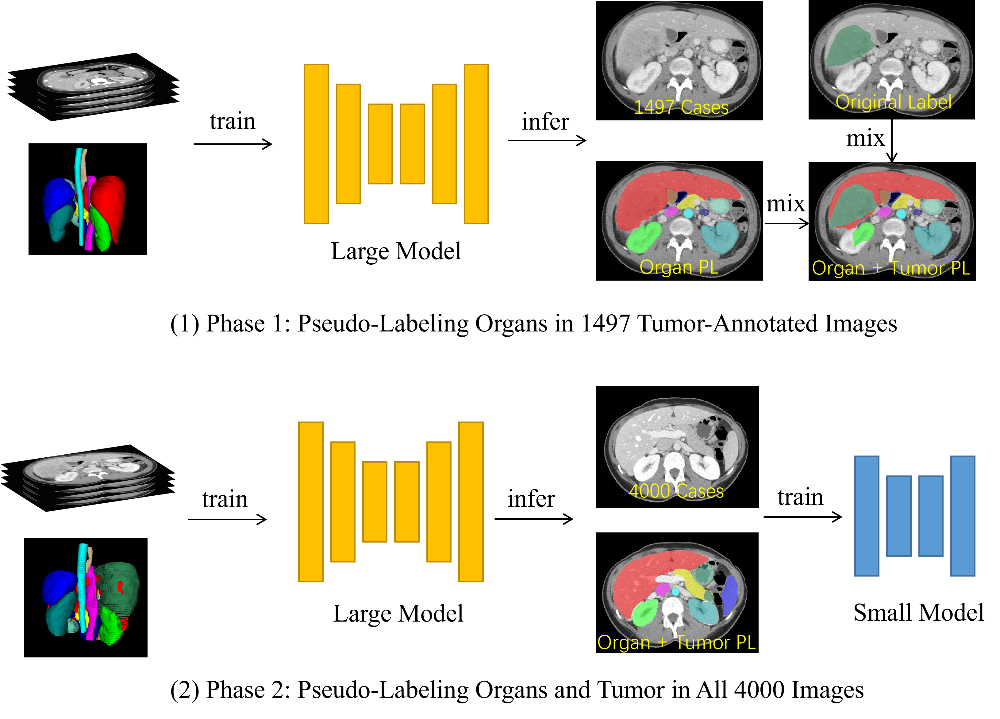
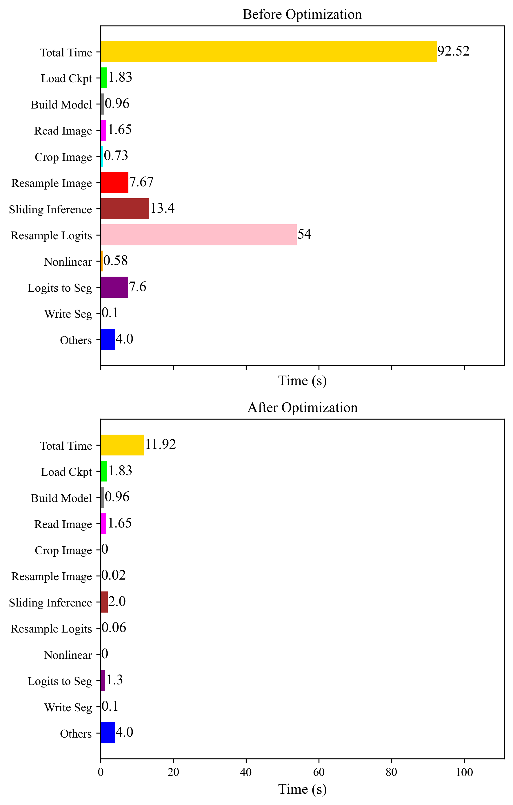

# 🔥 FLARE23 Solution

This repository contains our solution for the FLARE23 challenge, based on nnU-Netv2.

## 🔍 Overview

Our approach employs a two-stage pseudo-labeling method to tackle the issue of partial labels for organs and tumors in the FLARE23 dataset. For more details, see the pipeline diagram below:



Additionally, we present a speed comparison for inference, both before and after optimizations on nnU-Netv2. The following diagram illustrates the improvements:



## ⚙️ Environment Setup

To set up the environment, follow these steps:

```
conda create -n FLARE23_blackbean
conda activate FLARE23_blackbean
```
Then make sure to install PyTorch 2 compatible with your CUDA version.
```
pip install -e .
```

# 🚂 Train

Training our nnU-Netv2 model consists of five main steps, as depicted in the pipeline figure above. Follow these instructions to conduct the training process effectively:

### Step 1: Large Organ Model Training
Firstly, prepare a dataset of 250 images with 13-organ labels. Use this dataset to train a large organ model. 

```bash
nnUNetv2_train TASK_ID 3d_fullres all -tr STUNetTrainer_large
```

### Step 2: Generate Pseudo Labels for Tumor Images
With the model trained in Step 1, generate pseudo labels for 1494 tumor-annotated images.

```bash
nnUNetv2_predict -i INPUT_FOLDER -o OUTPUT_FOLDER -d TASK_ID -c 3d_fullres -f all -tr STUNetTrainer_large
```

### Step 3: Merge Labels and Train Large Model
Merge the pseudo organ labels and actual tumor labels in 1497 images, and then train a large model using this merged dataset.

```bash
nnUNetv2_train TASK_ID 3d_fullres all -tr STUNetTrainer_large
```

### Step 4: Generate Pseudo Labels for All Images
Using the model trained in Step 3, generate pseudo labels for all 4000 images in the dataset.

```bash
nnUNetv2_predict -i INPUT_FOLDER -o OUTPUT_FOLDER -d TASK_ID -c 3d_fullres -f all -tr STUNetTrainer_large
```

### Step 5: Train Small Model for Deployment
Finally, train a small model on the dataset of 4000 images. This model will be used for deployment.

```bash
nnUNetv2_train TASK_ID 3d_fullres all -tr STUNetTrainer_base
```


## ⬇️ Download Checkpoints

Download the `checkpoint_final.pth` file from [BaiduNetDisk](https://pan.baidu.com/s/1Nt_ZD2lyp4mS9UA5Xeajuw?pwd=jip3). Place it in the `./model/fold_all/` directory.

## 🚀 Inference

1. Place your input images in the `./inputs` directory.
2. Run the prediction script:

```
sh predict.sh
```

This will generate the output in the `./outputs` directory.
